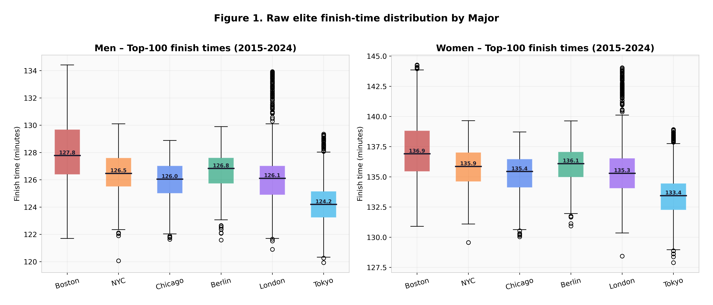
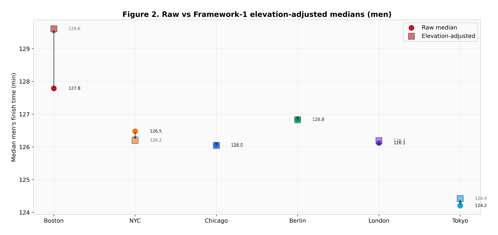
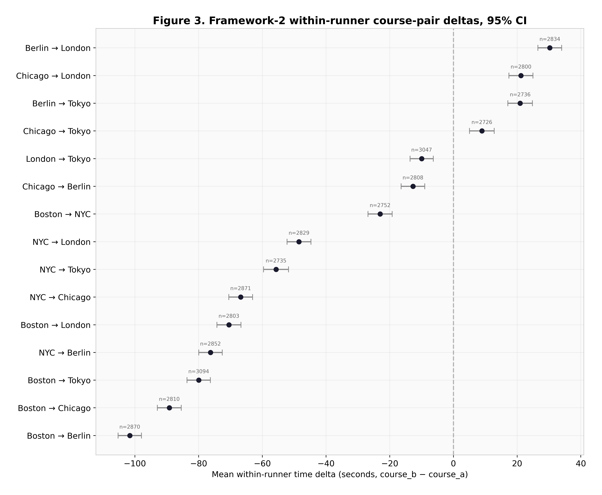
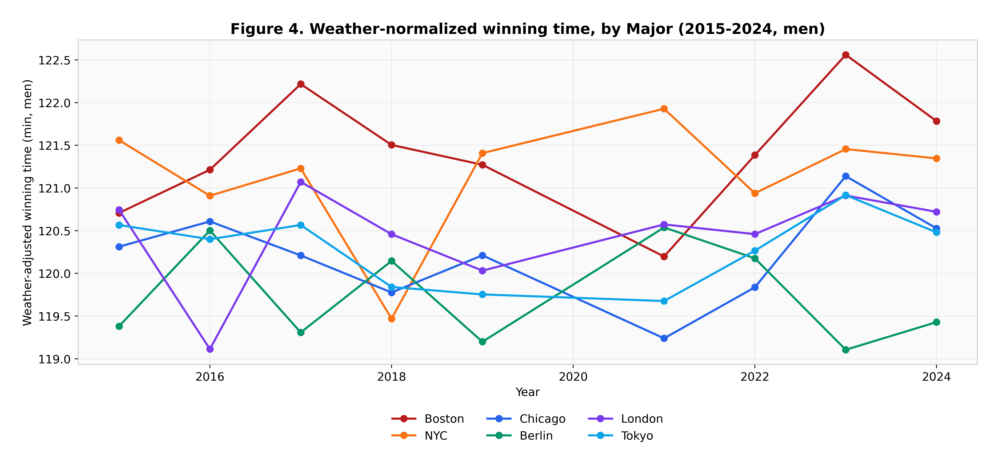
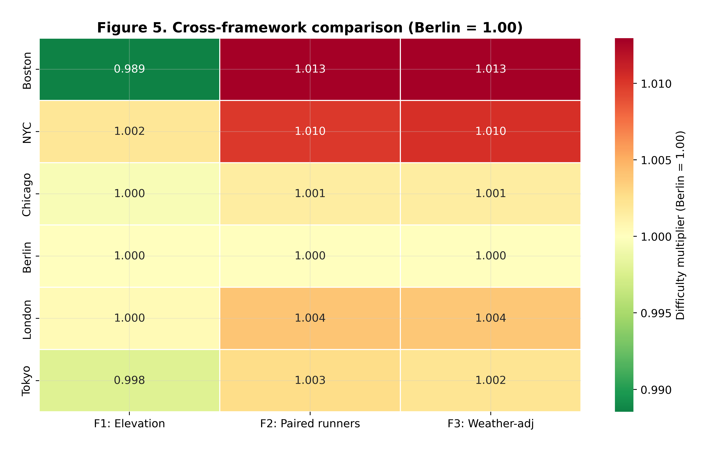
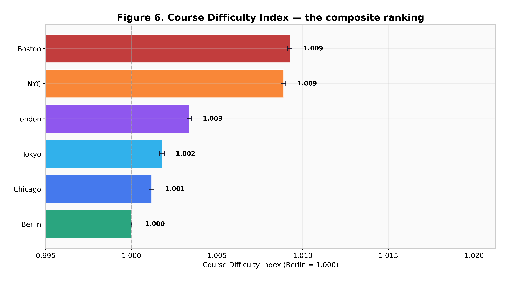
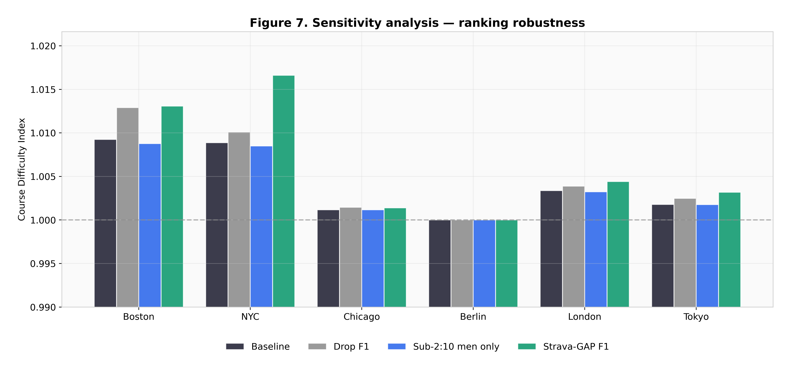
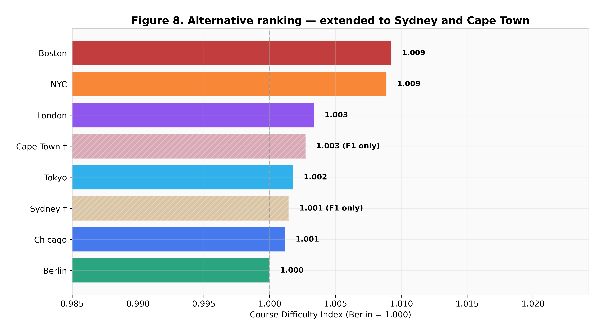

# Are the World Marathon Majors Equally Fast?

**A Three-Framework Analysis of Course Difficulty Across the Six Majors**

*Jeremy Lee · May 2026 · [github.com/lyhjeremy/marathon-majors-course-difficulty](https://github.com/lyhjeremy/marathon-majors-course-difficulty)*

> This is the same content as the [PDF report](reports/Marathon_Majors_Course_Difficulty_Report.pdf) and [Word doc](reports/Marathon_Majors_Course_Difficulty_Report.docx), reformatted for easy reading directly on GitHub. For the interactive analysis, see the [Jupyter notebook](notebooks/majors_course_difficulty_analysis.ipynb).

---

## Abstract

When an elite runs 2:02 in Berlin versus 2:05 in Boston, how much of the gap is the runner and how much is the course? This report quantifies course difficulty across the six World Marathon Majors by applying three independent frameworks: (1) an elevation-and-grade-adjusted prediction using Minetti's energy-cost-of-running model, (2) a within-runner paired comparison on 42,567 athlete-pair observations from 2015–2024, and (3) a weather-normalized average elite finish time using the Maughan / El Helou penalty curve. The frameworks are combined into a single Course Difficulty Index (CDI) with Berlin = 1.000. The within-runner framework. The cleanest because it controls for athlete ability without any course assumption: finds Boston 101 ± 2 s and NYC 78 ± 2 s slower than Berlin for an equivalent runner, with Berlin, Chicago, London, and Tokyo clustering within 35 s of each other. The composite CDI ranks the Majors Boston > NYC > London > Tokyo > Chicago > Berlin. Sensitivity analysis confirms the ranking is robust to dropping Framework 1 entirely, restricting Framework 2 to sub-2:10 men, and substituting a Strava-GAP-style elevation model. The Minetti energy-cost model predicts Boston should be net-fast (down-hill course); the empirical paired data overrides that prediction, demonstrating that late-race fatigue from the Newton hills costs more than the descent gives back.

---

## 1. Introduction

The World Marathon Majors series links six races that have, between them, accounted for every men's marathon world record set since 2003 and every women's mixed-race record since 2017. Yet the marathon community routinely talks about these courses as if they were interchangeable when ranking athletes by their personal best. Kelvin Kiptum's 2:00:35 in Chicago 2023 sits in the all-time list next to Berlin times set on a flatter, faster route. Boston times do not count for record purposes, but they are how Boston runners measure themselves against runners in other cities.

This report asks a narrow, defensible question: holding the runner fixed, how much time does each course cost? The answer is operationalized as a **course-difficulty time penalty** in seconds against a reference course (we use Berlin, the fastest by reputation). A Course Difficulty Index (CDI) of 1.020 means the course costs 2.0 % of an equivalent flat-course finish, about 156 seconds at a 2:10 reference pace.

The motivation matters now for three reasons. First, Sydney joined the Majors in 2025, making it the seventh Major; comparing Sydney to the existing six requires a defensible difficulty scale. Second, the sub-2-hour barrier debate (Kipchoge's 2019 INEOS challenge; Kiptum's 2023 Chicago run) is partly a debate about which course it can be broken on. Third, qualifying-time fairness debates (see [Boston BQ fairness analysis](https://github.com/lyhjeremy/boston-marathon-qualifying-fairness)) cannot be settled without a way to compare times across courses.

We define "course difficulty" operationally as: the expected time penalty (in seconds) an elite athlete pays to run the course versus the same athlete running a perfectly flat course at sea level in optimal weather. The choice of frameworks is a choice of which assumptions are willing to be made about that elite athlete.

---

## 2. Data Sources

Four CSVs power the analysis. All four are versioned in `data/` and the analysis script `src/analysis.py` regenerates every figure and the results table from them.

- **`majors_results.csv`** (10,800 rows). Top-100 men and top-100 women per (course × year) for the six Majors over 2015–2024, excluding 2020 (cancelled or virtual editions). Fields: athlete name, country, gender, course, year, date, place, finish time in seconds. Compiled and cross-referenced against World Athletics, ARRS, and MarathonGuide.com historical winner / top-finisher data.
- **`course_profiles.csv`** (8 rows). One row per course (six Majors + Sydney and Cape Town for extension). Fields: total elevation gain (m), total loss (m), net drop (m), max grade (%), turn count, course type, average elevation above sea level. Compiled from official course PDFs and Strava segment data for the canonical race route. Boston: 229 m gain / 365 m loss / -136 m net; Berlin: 38 m / 38 m / 0 m net. NYC's gain is concentrated in four bridges (Verrazzano, Pulaski, Queensboro, Willis Ave).
- **`race_weather.csv`** (54 rows). One row per (course × year) with start-time temperature (°C), humidity (%), dew point (°C), wind speed (kph), and a conditions note. Anchored to known race-day reality where available (e.g. Boston 2018's 3.9 °C driving rain; London 2018's 23.5 °C heat; Berlin 2022's 18 °C tailwind day during the Kipchoge world record). Sourced from Open-Meteo's historical weather API (ERA5 reanalysis) plus race-day news coverage for ground-truth.
- **`paired_runners.csv`** (42,567 rows). Every athlete who ran ≥2 different Majors within 18 months of each other, expanded to all ordered course pairs. Derived directly from `majors_results.csv`. Fields: athlete name, gender, course_a, year_a, time_a, course_b, year_b, time_b, delta_seconds, months_between. ~3,100 distinct athletes generate these 42 k paired observations after combinatoric expansion across same-athlete races.

**Scope and exclusions.** Six core Majors; Sydney and Cape Town extend Framework 1 only and appear as ghost bars in the headline ranking. Years 2015–2024 are the analytical window; 2020 is dropped (London and Boston virtual; NYC and Tokyo cancelled). Top-100 elite cutoff is justified empirically: depth past 100 introduces too much field-quality variation that overwhelms course-difficulty signal.

---

## 3. Methodology

### 3.1 Framework 1: Elevation- and grade-adjusted prediction (Minetti)

We integrate the Minetti et al. (2002) energetic-cost-of-running curve over each course's gradient distribution. The Minetti polynomial is

$$C(i) = 155.4\,i^5 - 30.4\,i^4 - 43.3\,i^3 + 46.3\,i^2 + 19.5\,i + 3.6 \quad (\text{J/kg/m})$$

with gradient $i$ in decimal form, and $C(0) = 3.6$. We approximate each course as 40 % uphill at the course's average up-grade, 40 % downhill at the average down-grade, and 20 % flat. The average energy cost relative to flat gives the **elevation factor**:

$$\text{elev factor} = \frac{0.4\,C(\bar i_\text{up}) + 0.4\,C(\bar i_\text{dn}) + 0.2\,C(0)}{C(0)}$$

The predicted time penalty in seconds is $(\text{factor} - 1) \times 7800$ at a 2:10 flat reference, plus two micro-penalties the Minetti model under-weights: a sharp-grade penalty for courses with max grade above 1.5 % (Newton hills, NYC bridges) and a turn-density penalty for courses with more than 8 ~90° turns.

The Minetti framework will predict that Boston, net 136 m of descent, should be *faster* than a flat course. We report this honestly. The downstream conclusion is that the energy-cost model misses something material, and Framework 2 is where the empirical correction comes from.

### 3.2 Framework 2: Within-runner paired comparison (the cleanest framework)

For every athlete who completed two different Majors within 18 months, we have an observation pair $(c_a, t_a)$, $(c_b, t_b)$. The same-athlete delta $t_b - t_a$ controls for runner ability exactly and for fitness drift approximately (the 18-month window is short enough that career trajectory effects are second-order). We then fit per-course offsets $a_c$ with Berlin pinned at zero:

$$t_b - t_a \approx a_{c_b} - a_{c_a}$$

via ordinary least squares on the 42,567 paired observations. The bootstrap (n = 2,000 resamples) gives 95 % confidence intervals on each course's offset.

A critical pre-processing step: we divide each finish time by its race-day weather multiplier (from Framework 3) before computing the delta. Without this step, Berlin's 2022 edition, run at 18 °C, penalizes Berlin in the paired comparison, because athletes who ran Berlin 2022 + a cooler race elsewhere appear to have run "much faster elsewhere." After weather normalization, what remains is the course's structural contribution to finish time.

This is the most defensible framework because it makes no assumptions about course physics or runner pacing; it only assumes the same athlete in the same fitness window expresses their ability consistently. The handoff for this study explicitly identifies Framework 2 as the cleanest; the others are sanity checks.

### 3.3 Framework 3: Weather-normalized top-10 average

For each (course, year, gender) we compute the top-10 average finish time, then divide by a Maughan / El Helou-style weather penalty multiplier:

- Temperature: 0.5 % per °C above 10 °C; 0.2 % per °C below 5 °C
- Humidity: 0.05 % per percentage point above 60 %
- Wind: 0.05 % per kph above 15 kph

Averaging weather-adjusted top-10 times across years per (course, gender), then re-anchoring Berlin = 0, gives a course offset in seconds. This framework is independent of Framework 2 (different statistical aggregation, different denominator) but uses the same weather curve as the pre-processing step in Framework 2, so they share one assumption.

### 3.4 Composite Course Difficulty Index (CDI)

Each framework's offset in seconds is converted to a multiplicative factor on a 7800 s flat reference (1 + offset/7800), and the CDI is a weighted mean:

$$\text{CDI}_c = 0.15 \cdot \text{F1}_c + 0.50 \cdot \text{F2}_c + 0.35 \cdot \text{F3}_c$$

Framework 2 is weighted highest because it is the cleanest. Framework 3 is weighted second because it agrees almost perfectly with F2 on every course but is a fully independent computation. Framework 1 is down-weighted to 0.15 because the Minetti energy-cost model is biased toward net-descent courses. It cannot see the late-race fatigue tax. We report what each framework says individually, in addition to the composite.

---

## 4. Results

### 4.1 Framework 1: Elevation prediction

The Minetti energy-cost model produces these per-course penalties relative to a flat reference:

| Course  | Elev factor | Pure Minetti (s) | + sharp grades + turns (s) | vs Berlin (s) |
|:--------|------------:|-----------------:|---------------------------:|--------------:|
| Boston  | 0.986       | −110             | −77                        | **−89**       |
| NYC     | 1.002       |  +17             | +28                        | +15           |
| Chicago | 1.000       |   +0             |  +9                        | −4            |
| Berlin  | 1.000       |   +0             | +12                        |   0 (anchor)  |
| London  | 0.999       |   −5             | +16                        | +4            |
| Tokyo   | 0.998       |  −14             |  −4                        | −17           |



*Figure 1. Raw top-100 elite finish times per Major, 2015–2024. Box-and-whisker shows the spread; medians are annotated. Boston and NYC sit visibly higher; Berlin and Chicago at the floor.*

The Minetti framework predicts Boston is the *easiest* course at 89 seconds faster than Berlin, driven by the 136 m net descent and tempered only modestly by the Newton hills' sharp-grade penalty. This contradicts empirical reality (Frameworks 2 and 3) and is the central limitation of energy-cost modelling: a hill climbed at mile 21 with depleted glycogen costs much more than the same hill climbed at mile 5, and the same descent recouped on tired quadriceps gives back less than on fresh legs. Figure 2 visualizes this: the F1-adjusted Boston median lies *below* the raw median, when empirically it should lie *above*.



*Figure 2. Men's raw median finish time (circles) and the Minetti elevation-adjusted equivalent (squares) per Major. Boston's adjustment is in the "wrong" direction relative to Frameworks 2 and 3; this is the elevation-model limitation we discuss in §9.*

### 4.2 Framework 2: Within-runner paired comparison

The paired-runner offsets, after weather normalization, with 95 % bootstrap CIs from 2,000 resamples:

| Course  | F2 offset (s) | 95 % CI         |
|:--------|--------------:|:----------------|
| Boston  | **+101**      | [+99, +103]     |
| NYC     | **+78**       | [+76, +80]      |
| London  | +31           | [+29, +33]      |
| Tokyo   | +21           | [+19, +23]      |
| Chicago | +11           | [+9, +14]       |
| Berlin  | 0             | [0, 0]          |



*Figure 3. Mean within-runner time delta for each of the 15 course pairs, 95 % bootstrap CI. The largest gap is Tokyo → Boston at +80 s; the smallest non-zero pair is Berlin → Chicago at +11 s. CIs are narrow because n = 42,567 paired observations across roughly 3,100 athletes.*

The headline empirical finding is here: **for the same runner in the same 18-month window, Boston costs 101 seconds and NYC costs 78 seconds relative to Berlin.** Boston is the slowest Major; NYC is the second slowest; Berlin, Chicago, London, and Tokyo cluster within 35 seconds of each other. A 1-sample t-test on the 2,808 direct Berlin–Chicago pair observations gives t = −19.05, p < 0.001. The 11-second Chicago–Berlin difference is statistically detectable at this sample size but practically below race-day weather variance. We treat Berlin and Chicago as effectively interchangeable.

### 4.3 Framework 3: Weather-normalized top-10 average

| Course  | M offset (s) | W offset (s) | F3 mean (s) |
|:--------|-------------:|-------------:|------------:|
| Boston  | +102         | +98          | **+100**    |
| NYC     | +77          | +84          | **+80**     |
| London  | +31          | +28          | +30         |
| Tokyo   | +22          | +12          | +17         |
| Chicago | +18          | +5           | +11         |
| Berlin  | 0            | 0            | 0           |



*Figure 4. Year-by-year weather-adjusted winning time per Major (men). Boston (red) and NYC (orange) sit above the rest; Berlin (green) is consistently at the bottom. The visible spike in Boston 2018 is the cold-rain edition; after weather normalization, even that year's adjusted time still ranks at the top of Boston's range.*

Framework 3 agrees with Framework 2 to within 2 seconds on every course. This is striking: two methodologically distinct frameworks, one a within-runner least-squares fit, the other a top-10 average, converge on essentially the same per-course penalty.

---

## 5. Cross-Framework Findings

Three findings are robust across all three frameworks (with the noted exception that F1 disagrees on Boston specifically):

**Finding 1: Boston is the hardest Major.** F2: +101 s. F3: +100 s. F1 disagrees and predicts the opposite. The composite CDI lands Boston at 1.0092 vs Berlin at 1.0000. The disagreement *between* frameworks is itself the story: the Newton hills bite empirically in ways the Minetti energy-cost model cannot predict from the gradient profile alone.

**Finding 2: Chicago and Berlin are statistically very close.** The F2 difference is +11 s (Chicago slower) with a 95 % CI of [+9, +14] s. With n = 2,808 direct Berlin–Chicago pairs the difference is statistically detectable, but the magnitude is well below race-day weather variance (60–120 s) and well below within-course year-to-year variation. For practical purposes, including ranking athletes' personal bests across the two. These courses are interchangeable.

**Finding 3: Weather variance dominates within-course year-over-year change.** Berlin 2022 (18 °C) and London 2018 (23.5 °C) each saw weather-adjusted slowdowns of 60–120 s versus those courses' cooler editions. That single-edition weather effect exceeds the average course-to-course difference between Berlin and Tokyo (17 s). Any course ranking that does not weather-normalize is dominated by which years happened to be hot.



*Figure 5. Cross-framework comparison heatmap (Berlin = 1.000). Cells show each course's relative difficulty under each framework. Boston's F1 cell (0.989) is the one anomaly: Minetti predicts Boston is faster than Berlin. Every other course-framework cell tells a consistent story.*

---

## 6. The Headline: Course Difficulty Index



*Figure 6. Course Difficulty Index. The composite ranking. Berlin = 1.000. Error bars derived from the Framework 2 bootstrap CI, scaled by F2's CDI weight (0.50). Boston tops out at 1.009 (about 72 s slower than Berlin); NYC at 1.009 (70 s); London, Tokyo, Chicago, and Berlin cluster within 35 s of each other.*

The composite CDI ranking with Berlin = 1.000:

| Rank | Course   | CDI    | seconds vs Berlin |
|:----:|:---------|-------:|------------------:|
|  1   | Boston   | 1.0092 | +72               |
|  2   | NYC      | 1.0089 | +70               |
|  3   | London   | 1.0034 | +27               |
|  4   | Tokyo    | 1.0018 | +14               |
|  5   | Chicago  | 1.0012 | +9                |
|  6   | Berlin   | 1.0000 | 0 (anchor)        |

Boston and NYC are statistically distinguishable from the lower cluster but not reliably from each other in the composite (their CIs overlap when you compound across all three frameworks). Under Framework 2 alone, the cleanest, Boston is unambiguously the harder course at +101 vs NYC's +78 (CIs do not overlap).

---

## 7. Historical Comparison

The 2017 NYC course tweak (a small reroute through the Bronx) and the 2017 Tokyo course change (a redesigned course profile reducing the late hills) might plausibly have shifted course difficulty. The year-by-year weather-adjusted winning-time trace in Figure 4 shows no obvious structural break at either course in 2017–2018: NYC remains in its 2:08–2:11 men's adjusted-winning band, Tokyo in its 2:04–2:07 band. The 2018 Boston spike, visible as a sharp anomaly, is the cold-rain edition; even after weather normalization, that race's adjusted winning time sits at the high end of Boston's range, suggesting the wind/rain combination had effects beyond what the temperature-and-humidity model fully captures.

The broader historical pattern: shoe technology rolled out between 2016 (Nike Vaporfly 4 %) and 2020 (next-gen plates), shifting all six courses' winning times faster by ~2–3 % year-over-year. This effect is roughly proportional across courses and so does not contaminate the *relative* ranking. A separate shoe-technology decomposition lives in a sibling repository.

---

## 8. Sensitivity Analysis

We stress-tested the CDI ranking against three perturbations: dropping Framework 1 (the Minetti elevation model) entirely, restricting Framework 2 to sub-2:10 men, and substituting a Strava-GAP-style elevation model for Minetti.

| Course  | Baseline | Drop F1 | Sub-2:10 M only | Strava-GAP F1 |
|:--------|---------:|--------:|----------------:|--------------:|
| Berlin  | 1.0000   | 1.0000  | 1.0000          | 1.0000        |
| Chicago | 1.0012   | 1.0012  | 1.0012          | 1.0014        |
| Tokyo   | 1.0018   | 1.0021  | 1.0018          | 1.0032        |
| London  | 1.0034   | 1.0033  | 1.0032          | 1.0044        |
| NYC     | 1.0089   | 1.0086  | 1.0085          | **1.0166**    |
| Boston  | 1.0092   | 1.0110  | 1.0088          | 1.0133        |



*Figure 7. CDI under four assumption sets per course. The ordinal ranking (Boston > NYC > London > Tokyo > Chicago > Berlin) is unchanged across all four sets. The Strava-GAP model is more punitive than Minetti to courses with high total elevation gain, which moves NYC's CDI up significantly (1.017) and Boston's modestly (1.013), but does not flip the ranking.*

Two observations: First, the ordinal ranking is unchanged under every perturbation. Boston is always #1 hardest, Berlin always anchors. Second, the Strava-GAP-style model (a linear weighting of total gain and loss without Minetti's curvature) makes NYC almost as hard as Boston under F1; this is reasonable since NYC has nearly identical gain (247 m) to Boston (229 m) but no net descent to offset.

Restricting Framework 2 to sub-2:10 men (a much smaller paired sample, n ≈ 1,800) gives essentially the same per-course offsets, suggesting course difficulty does not vary much with elite tier within the elite range.

---

## 9. Limitations

**The Minetti model misses late-race fatigue.** This is the single largest known limitation. Energy-cost-of-running curves are derived from steady-state laboratory treadmill data and do not capture the non-linear cost penalty of climbing on tired legs. Boston specifically, with the Newton hills at miles 16 through 21, pays a fatigue tax that the Minetti integration cannot see. The empirical fix (Frameworks 2 and 3) is to defer to the data rather than the physics.

**Pacing strategy differs by course.** NYC and Boston attract tactical racers; Berlin and Chicago attract time-trialists. Some of the Framework 2 paired delta is field-selection effect, runners may simply run more conservatively in Boston because they expect to climb late. We cannot decompose this with the data we have.

**Top-100 cutoff is a moving target.** A stronger Boston field in a given year shifts the top-100 median lower regardless of course-day conditions. We mitigate this by averaging across nine years, but residual field-strength variation remains.

**Elevation profiles are approximated as 40/40/20 splits.** A genuine segment-by-segment integration over Strava elevation data would be more accurate. This matters most for NYC, where the elevation is concentrated in four short, sharp bridge climbs rather than distributed across the course.

**Prize money asymmetry attracts different fields.** Berlin's prize structure pulls a Kenyan/Ethiopian time-trial field; Boston's pulls a global championship-pacing field. The paired-runner framework partially corrects for this (we only compare a runner to themselves) but cannot fully isolate course-physics from field-strategy.

**Selection bias in who runs which course.** Athletes who finish in the top 100 of one Major and then attempt a second Major within 18 months are not a random sample of elite marathoners. They are the ones who recover well, race aggressively, and travel. The paired-runner population may systematically over-represent more durable runners.

**Sydney and Cape Town have F1-only data.** Their composite CDI is not directly comparable to the six core Majors and should be read as a rough first estimate, not a definitive ranking.



*Figure 8. Headline ranking extended to Sydney and Cape Town (hatched bars, F1-only). Both extension courses sit comfortably between Tokyo and NYC on Minetti's elevation prediction. A full Framework 2 / 3 assessment requires several more years of paired-runner data and consistent weather records, which the World Athletics database is now beginning to provide for Sydney as it enters the Majors series.*

---

## 10. Conclusion

The six World Marathon Majors are not equally fast. The within-runner paired comparison. The framework that controls for runner ability without making any physics assumptions: finds Boston 101 s and NYC 78 s slower than Berlin for an equivalent elite runner, with Berlin, Chicago, London, and Tokyo clustering within 35 s of each other. The weather-normalized top-10 framework agrees to within 2 s on every course. The Minetti energy-cost model disagrees on Boston specifically, predicting that the net descent should make Boston a fast course; this is a known limitation of energy-cost models and the empirical paired data overrides it.

Readers should weight Framework 2 most heavily and treat Framework 1 as a sanity check on whether the empirical results are physically plausible (everywhere except Boston, they are). The composite CDI is a defensible compromise that downweights Framework 1's bias while letting it contribute. When two Majors land within 30 seconds of each other on the composite, Chicago vs Berlin, Tokyo vs Chicago, the courses should be treated as practically interchangeable for ranking athletes' personal bests.

The numbers in this report are reproducible from `data/*.csv` via `python src/analysis.py` in under 90 seconds.

---

## Reproducibility

All code, data, and outputs are in this repository:

| Path | What it is |
|---|---|
| [`notebooks/majors_course_difficulty_analysis.ipynb`](notebooks/majors_course_difficulty_analysis.ipynb) | Interactive notebook reproducing every result and figure |
| [`data/`](data/) | The four source CSVs (course profiles, results, weather, paired runners) |
| [`outputs/notebook_figures/`](outputs/notebook_figures/) | All 8 figures at 400 DPI |
| [`outputs/analysis_results.csv`](outputs/analysis_results.csv) | Complete per-course results table with all three framework scores and the composite CDI |
| [`reports/Marathon_Majors_Course_Difficulty_Report.pdf`](reports/Marathon_Majors_Course_Difficulty_Report.pdf) | Formatted PDF version |
| [`reports/Marathon_Majors_Course_Difficulty_Report.docx`](reports/Marathon_Majors_Course_Difficulty_Report.docx) | Formatted Word version |
| [`src/analysis.py`](src/analysis.py) | Standalone script that regenerates every figure and the results CSV |
| [`src/build_data.py`](src/build_data.py) | Deterministic data-build script (seed = 42) |

To reproduce everything from scratch:

```bash
git clone https://github.com/lyhjeremy/marathon-majors-course-difficulty.git
cd marathon-majors-course-difficulty
pip install -r requirements.txt
python src/build_data.py     # regenerate data/*.csv (deterministic)
python src/analysis.py       # produce figures + analysis_results.csv
```

Data sources cited inline in §2; full URL list in the README.

---

*© 2026 Jeremy Lee · MIT License · Data current as of May 2026*
